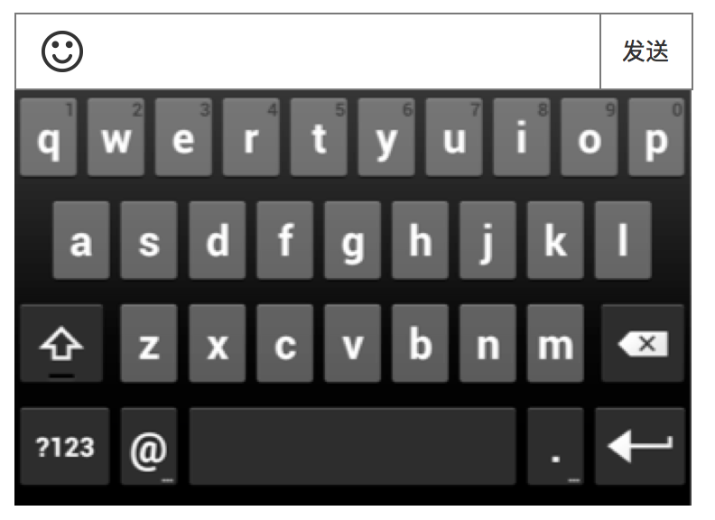

### 弹幕
* 调出的输入法，需要自定义1个表情入口
* 在非全屏、全屏下，都可以发弹幕
* 非全屏时，键盘从下方出现
* 全屏时，进入新页面进行输入

### 1. 发弹幕

规则

* 最大的输入字数为20字，可以和表情一起发
* 支持发emoji，由于emoji各个系统可能有差异，不做统一，识别出来是如何，就展示什么

### 2. 弹幕显示
有2个地方显示弹幕

1. 主要在播放器里
2. 其次在聊天列表里

#### 在播放器里

会是这样的

此规则适用于播放器默认、播放器全屏

* 方向：从右到左
* 颜色：随机。主要是黄色，爱拍的主题色
* 弹幕的水平位置是随机的，但是不会和上一个弹幕重复，比如，上一个是 y+6，那么下一个不能是是y+6，否则可能会重叠弹幕，或者很久都显示不出来
* 目前弹幕不支持用户自定义字号、字体颜色、出现为止、出现方式

#### 在聊天列表里
纯粹就是聊天记录的形式，用户发了什么，就显示这条记录，详细见 [聊天列表](chat.md) 的聊天信息列表

