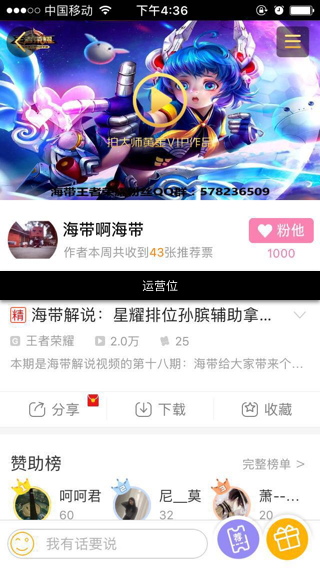

### 入口
* 根据情况，出现不同入口
* 其中运营位，可以在后台控制
* 通过不同的入口，最终都是进入到直播房间

### 1. 系统推送
系统下拉通知栏，点击后直接进入直播间

* 需要能够通过链接进入到app的直播间

#### 触发

* 关注的主播开始直播时

### 2. 作者的个人空间

* 如果作者在直播
* 那么进入他个人空间时，会看到“直播中”的提示
* **该功能已经在爱拍平台里使用**

#### 触发
* 主播开始直播时，显示
* 结束直播时，隐藏

### 3. 运营位

* 爱拍运营后台配置的
* 在作者信息和视频信息的中间，会插入运营位
* 用于运营推广制定的主播
* 无论是否已关注的作者
* 只要观众在录播视频页时，就会出现
* 不能关闭
* **该功能已经在爱拍平台里使用**

#### 触发
* 在爱拍的运营后台配置时生效，直到取消