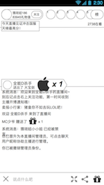

### 功能概述
和pc不一样，app由2部分组成

1. 直播房间
2. 入口

### 1. 直播房间
界面

美术风格没有明显的UI色块，使用元素直接改在视频流上，多使用透明透明度

---

模块构成

##### 观众，在房间里进行绝大部分交互，如

* 观看
* 发弹幕
* 送礼
* 充值
* 分享

##### 登录状态对信息的影响
用户登录前后，看到的信息都是一样的，但是以下功能会触发验证登录状态

* 发弹幕
* 送礼
* 充值
* 关注

##### 主播，与pc功能不同，并没有管理观众的功能

### 2.入口
和pc一样，根据推送和后台控制开关来控制入口，没有固定的入口频道
