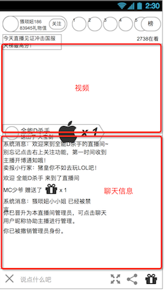

# 播放器一般
* 播放器默认是竖屏
* 视频窗体是长方形，黑色
* 如果视频是长宽比是横的，那么未填满的地方用黑色，视频是竖的也是一样

### 操作UI

包含功能

1. 播放/暂停 视频。双击视频区域触发
2. 全屏。点击按钮进入全屏播放器，横置手机也会触发
3. 返回。退出直播房间
4. 送礼。详细见 [送礼功能](app/gift.md)
5. 分享
* 弹出分享菜单
	* 分享内容
		* 标题：调用**`房间名字`**
		* 内容：类似视频简介，部分的分享形式有，调用**`作者简介`**
		* 缩略图：调用**`视频封面`**
		* 链接：**`直播间地址`**，由于pc、app使用同一链接，需要判断打开的客户端是pc还是移动端，pc跳转 pc网页，移动端跳转 h5

### 弹幕显示
用户发动的弹幕从右到左显示，规则和pc的一样

### 送礼效果
礼物的弹幕效果会在这里显示，规则和pc的一样