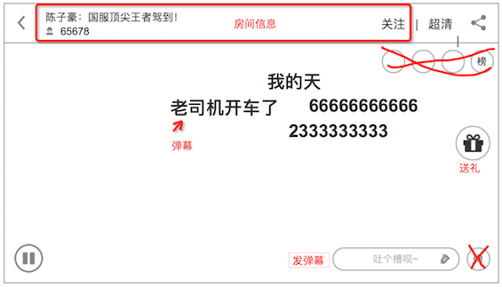

### 播放器全屏
* app的全屏，是全功能的，和pc不同
* 可以发弹幕、送礼、充值

### 界面

* 图中用红色划除部分，为该版本 播放器全屏 不显示的功能，分别是“榜单”“热词“

### 操作UI
UI并不是常时显示

* 刚进入时，显示，没有操作时，3秒自动隐藏
* 点击屏幕，显示，再次点击，隐藏，没有操作时，3秒自动隐藏
* 发送完弹幕回来后，隐藏
* 送礼成功后回来，隐藏
* 分享成功后回来，隐藏

### 功能列表
1. **房间信息**：房间名、观看人数。和非全屏时的逻辑一样
2. **关注 按钮**。和非全屏时的逻辑一样
3. **清晰度选择**。目前标清320p、高清480p、超清720p，3种，根据视频会显示更多，如
4. **分享**。使用爱拍自身的分享sdk分享
5. **播放/暂停**。双击视频区域也触发
6. **送礼**。详细看[赠送礼物](app/gift.md)
7. **发弹幕**。点击后，调用键盘，发送弹幕
8. **退出全屏**。左上的返回按钮
9. **弹幕显示**。和非全屏时的逻辑一样
10. **送礼效果**。详细看[送礼效果](app/gifteffect.md)

