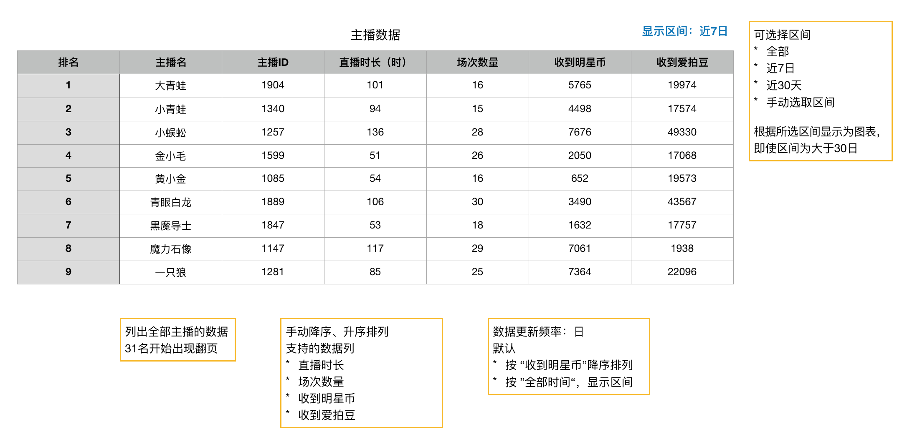

### 主播数据
* 全部主播的列表
* 用于观察主播的整体数据
* 数据更新规则：每小时，只计算直播结束的

### 页面

数据是礼物收益、场次数据里定义过的，在这里以主播为中心，进行再组织

功能：选择区间

* 默认显示 全部 的数据
* 可选择：全部、近7天、近30天、手动选取区间
* 手动选取的区间，不限制长度
* 数据超过30时，出现翻页

#### 排序
支持降序、升序排列

* 直播时长
* 场次数量
* 收到明星币
* 收到爱拍豆