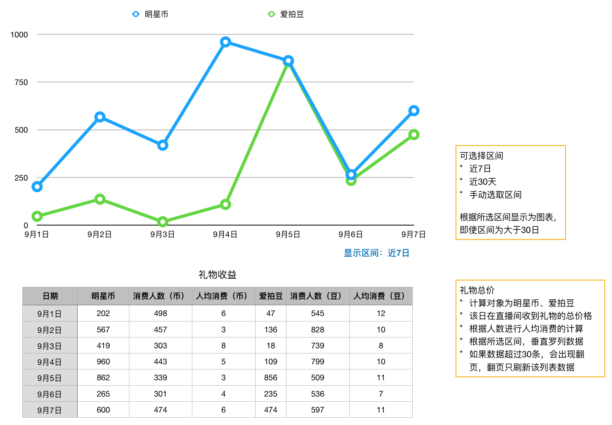

### 礼物收益
* 用于统计所有直播间的送礼数据

### 界面

### 数据
#### 折线图

* 统计明星币、爱拍豆的消费情况，按日显示，用于观察趋势
* 使用折线图，是因为数据会可能很多，比如1年，也可以显示出趋势

功能：选择区间

* 默认显示 近7天 的数据
* 可选择：近7天、近30天、手动选取区间
* 手动选取的区间，不限制长度

#### 列表

* 更详细地罗列数据
* 超过30条，会出现翻页控件
* 翻页只更新列表的数据，折线图依然保留在顶部

#### 数据定义

* 明星币：本日，在直播间，消费的明星币数量
* 消费人数（币）：本日，在直播间，送出了明星币购买的礼物的用户数量，去重
* 人均消费（币）：**明星币 / 消费人数（币）**

* 爱拍豆：本日，在直播间，消费的爱拍豆数量
* 消费人数（豆）：本日，在直播间，送出了爱拍豆购买的礼物的用户数量，去重
* 人均消费（豆）：**明星币 / 消费人数（豆）**
