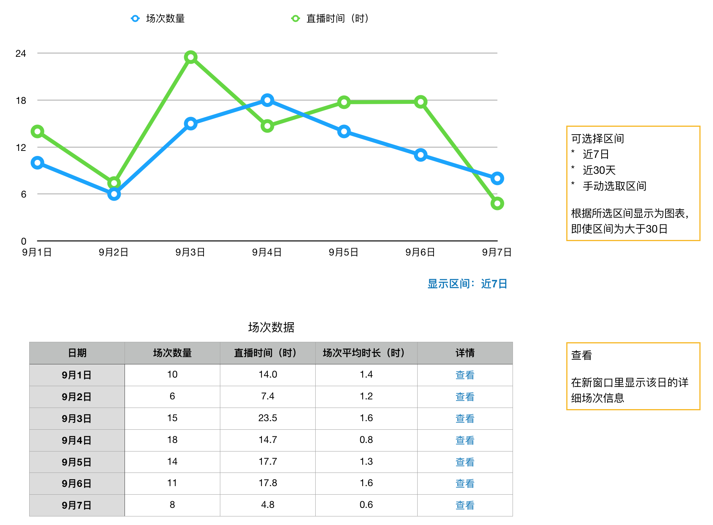
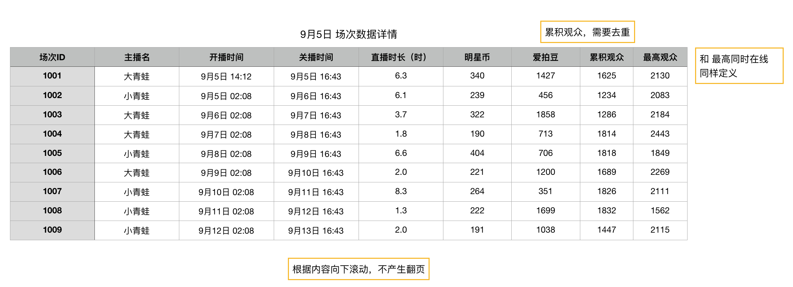

### 场次数据
* 用于统计所有直播间的直播数据
* 按照场次排列，即同一个主播，会有多个场次

### 界面

### 数据
#### 折线图
用于预览，按日，显示

* 场次数量
* 直播时长

功能：选择区间

* 默认显示 近7天 的数据
* 可选择：近7天、近30天、手动选取区间
* 手动选取的区间，不限制长度

### 列表

#### 数据定义

* 场次数量：当日，总共直播的场次数量。只有直播结束的场次才会计算，每小时更新
* 直播时间（时）：当日，总共直播的场次数量的累积时长。只有直播结束的场次才会计算，每小时更新
* 场次平均时长（时）：**直播时间 / 场次数量**

### 查看详情
点击 **`查看`** 可以看到该日的所有场次的数据，弹窗显示，不会反正翻页

弹窗

#### 数据定义
该列表的数据，是按照场次去组织的

* 场次ID：系统生成的场次ID，唯一标识
* 主播名：主播当前的用户名
* 开播时间：开始录播的时间，以主播开始推流的时间计算
* 关播时间：结束录播的时间，以主播关播并停止推流的时间计算
* 直播时长：**关播时间 - 开播时间**
* 明星币：本场次，消费的明星币
* 爱拍豆：本场次，消费的爱拍豆
* 累积观众：本场次，共计的用户数，去重
* 最高观众：本场次，最高在线人数

