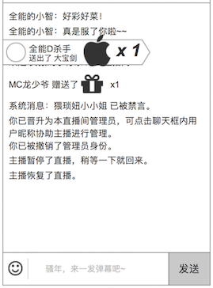

### 概述
* **用户被禁言、输入的弹幕、送礼**，这些记录信息（log）会出现在这里
* **用户进出** 这样高频的信息，不会出现在视频列表里，非常影响用户体验
* **是一个输入+输出的功能，弹幕、送礼、观众管理、房间信息、运营位，都会在这里进行部分或全部交互**

### 界面

### 输入弹幕文字和表情
详细见 [弹幕](danmaku.md)的发弹幕

### 聊天信息列表
* 不同类型的聊天信息，用不同颜色显示
* 最新信息，在下方显示，信息自动往上滚动

显示以下类型的信息

1. 弹幕。可以理解为用户的聊天信息，字体颜色黑色。详细见 [弹幕](function/danmaku.md)
2. 送礼。谁送了什么，这些，字体颜色橙色。详细见 [送礼](function/gift.md)
3. 房间信息的记录。谁被禁言了，谁被提升为管理员，这些，字体颜色灰色。详细见 [观众管理](function/usermanage.md)，[房间信息](function/roomadmin.md)

### 用户身份的标记
显示用户身份的标记

详细见 [观众管理](function/usermanage.md) 的 用户身份的标记

### 对用户的操作
* 如果是房管，会增加 `禁言` `踢出`，详细见 [观众管理](usermanage.md)
* 如果是管理员，点击观众，还会增加 `提升为房管`，让该选中的用户获得房管的权限，详细见 [房间信息](roomadmin.md)
