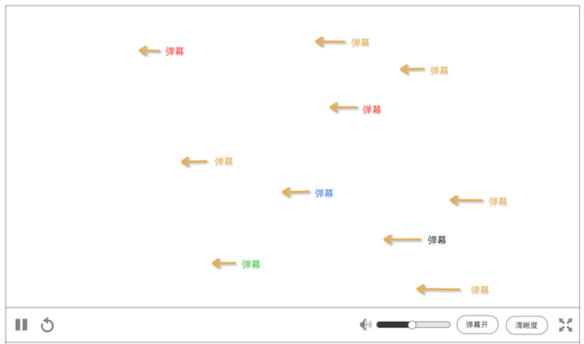

### 弹幕
弹幕功能分成2部分

1. 发弹幕
2. 弹幕显示

### 发弹幕
在 [聊天列表](chatlist.md) 模块下的输入框，才能发弹幕

规则

* 在 播放器默认 下，聊天列表 里才能发弹幕
* 播放器全屏，暂时不支持发弹幕
* 最大的输入字数为20字，可以发表情
* 发送后，有3秒冷却，**`发送`** 按钮置灰

### 弹幕显示
有2个地方显示弹幕

1. 主要在播放器里
2. 其次在聊天列表里

#### 1.在播放器里

会是这样的

此规则适用于播放器默认、播放器全屏

* 方向：从右到左
* 颜色：随机。主要是黄色，爱拍的主题色
* 弹幕的水平位置是随机的，但是不会和上一个弹幕重复，比如，上一个是 y+6，那么下一个不能是是y+6，否则可能会重叠弹幕，或者很久都显示不出来
* 目前弹幕不支持用户自定义字号、字体颜色、出现为止、出现方式

#### 2. 在聊天列表里
纯粹就是聊天记录的形式，用户发了什么，就显示这条记录，详细见 [聊天列表](chatlist.md) 的聊天信息列表
