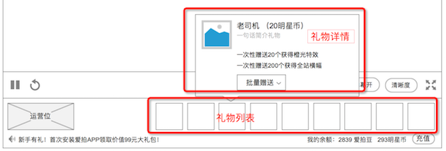

### 送礼
* 分为2部分：送礼、礼物效果
* 送礼，是在 播放器 下方进行的，已经罗列了礼物出来
* 礼物效果，送礼后，会在聊天列表显示浮层的动画效果，大额的送礼，会在播放器里滚动演出

### 界面

### 送礼物
在 播放器 下方，列出了所有礼物

* 鼠标悬停时，出现 礼物详情
* 点击后，出现赠送 赠送详情

* 选择赠送的数量，确认赠送
* 如果余额不足，会提示“余额不足”

### 礼物动画
赠送礼物后，会出现动画，动画的种类有2种

1. 聊天列表里显示，所有赠送的礼物，无论价格高低，都会在聊天列表里显示的
2. 在播放器里滚动，和弹幕的滚动规则一样，但是覆盖在播放器、弹幕上层

### 礼物动画的设定

