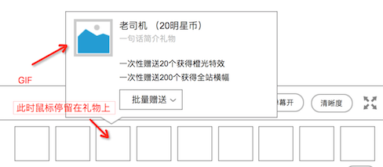
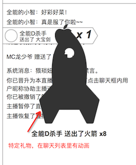

### 礼物设定
* 礼物目前有8种
* 每种的价格都不一，目前价格仅供参考高低
* 指定的礼物才有动画效果

### 美术需求
整体美术风格明亮

1个礼物，最多有3个美术资源

1. 图标。icon，在礼物列表里显示的，静态
	* 
2. 动图。鼠标放在礼物时，礼物详情里显示的礼物，是gif
	* 
3. 动画。在聊天列表里，显示的礼物动画，和动图不一样，应该是另外的gif，覆盖在聊天信息上
	* 

### 礼物列表

1. 稳
	* 价格：**0.1 明星币**
	* 描述语：没毛病，老铁，这波稳！
	* 美术描述：暴漫风格
2. 浪
	* 价格：**0.1 明星币**
	* 描述语：我可以划船不桨，全靠浪！
	* 美术描述：暴漫风格
3. 怼
	* 价格：**0.5 明星币**
	* 描述：闭嘴，让帅的先说话！
	* 美术描述：暴漫风格
4. 老司机
	* 价格：**1 明星币**
	* 描述语：没时间解释了，快上车！
	* 美术描述：暴漫风格
5. 制杖
	* 价格：**5 明星币**
	* 描述语：玛德制杖，主治一切不服！
	* 美术描述：暴漫风格
	* **`有动画`**
6. 拍仔
	* 价格：**10 明星币**
	* 描述语：让我们一起来啪啪啪！
	* 美术描述：调皮可爱的拍仔，和爱拍主站设定一致
	* **`有动画`**
7. 翅膀
	* 价格：**100 明星币**
	* 描述语：装上天使之翼，让我带你飞！
	* 美术描述：高贵的天使翅膀
	* **`有动画`**
8. 火箭
	* 价格：**500 明星币**
	* 描述语：给我一飞冲天吧！
	* 美术描述：随时准备发射的火箭
	* **`有动画`**