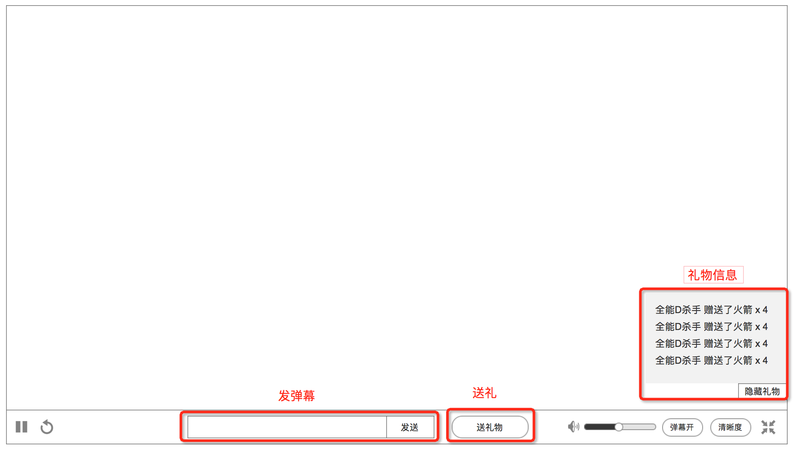

### 播放器全屏

* 进入全屏后，只显示直播房间的部分功能
* 界面的布局也会改变

### 该版本不实现的入口

1. 弹幕
2. 送礼

### 触发/隐藏 控制UI
隐藏鼠标后，移动鼠标就会再次显示

触发

* **视频正在载入、异常状态时，持续显示**
* 鼠标停留在屏幕底部1/3上，持续显示

隐藏

* 鼠标离开屏幕底部1/3，1秒，往下移出，隐藏鼠标

### 控制UI
1. 暂停 / 播放
	* 控制视频播放 或 暂停
	* 支持 键盘 **`空格`** 控制，即 “按空格后暂停，按空格后播放”
2. 重新载入
	* 重新载入视频，但不刷新页面
3. 音量调节
	* 控制音量大小
	* 支持键盘 **`上下箭头`** 去控制
4. 关闭 / 开启 弹幕
	* 显示 或 隐藏弹幕
5. 清晰度
	* 切换清晰度
	* 如果视频不支持某清晰度，则置灰 
	* 标清。380p
	* 高清。720p
	* 超清。1080p
6. 退出全屏
	* 返回 [播放器默认](player.md)
	* 支持 键盘 **`esc`** 控制
