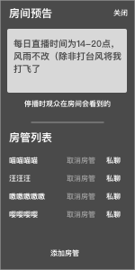
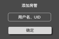

### 房间信息

主播才有修改的权限

### 1. 房间名字
在名字后方有可编辑的提示，点击名字或该提示都可以修改

* 点击 `修改房名` 进入编辑模式
* 开播前，可以任意修改
* 开播后，不可以修改

### 2. 房间公告
主要用于主播自己拉人、写公告信息、群号什么的

* 显示在公告区域
* 点击 `修改公告` 进入编辑模式
* 最大输入70字的纯文字公告

公告默认显示2行，大于2行时

* 鼠标悬停在上时，自动展开，展示全部内容
* 移开时，自动收齐

### 3. 房间管理
用于显示2个功能

* 房间预告
* 房管列表

#### a. 房间预告
当房间处于停播状态时，显示的提示信息，让主播可以写上自己的下次直播时间等信息

#### b. 房管列表
可以一览房间有多少个房管，同时有这些功能

* 私信。让主播快速通知他们，调用网站自身的私信功能
* 添加房管。输入玩家的名字，uid，添加为房管，弹出浮层
	* 
	* 如果用户不存在，在输入框里提示“不存在此用户”“不存在此BID”
	* 继续输入会清除之前的错误提示信息
	* 点击浮层以外的区域，会收起浮层
	* 添加成功后，会用toast提示“添加成功”
* 取消房管。取消该房管的资格，被取消的用户会收到系统的sms “你已经被xx主播取消了xx房间的房间管理权限”