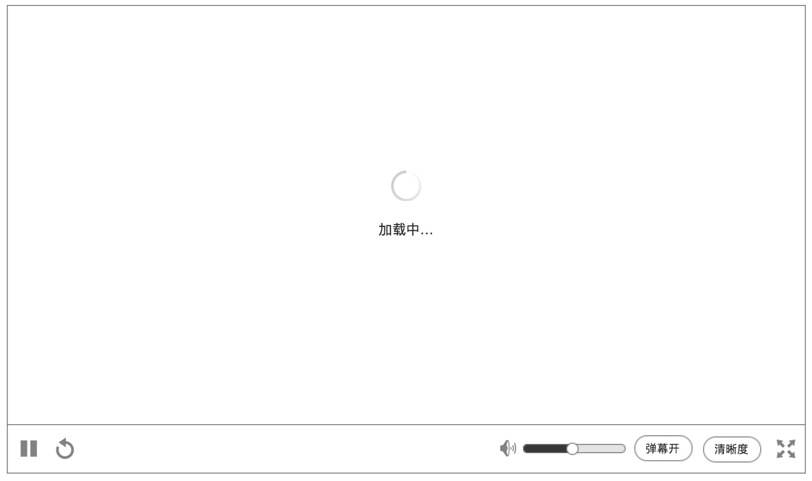
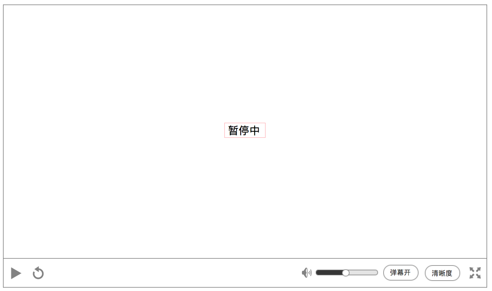
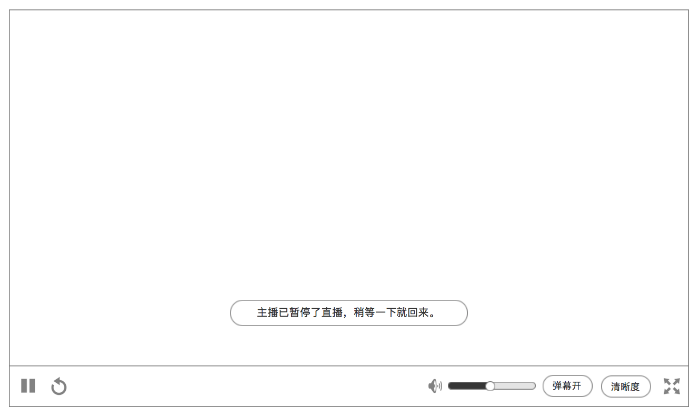
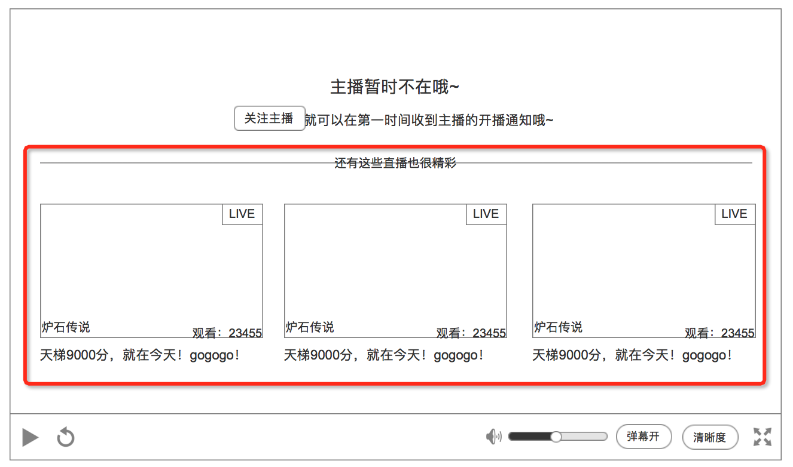
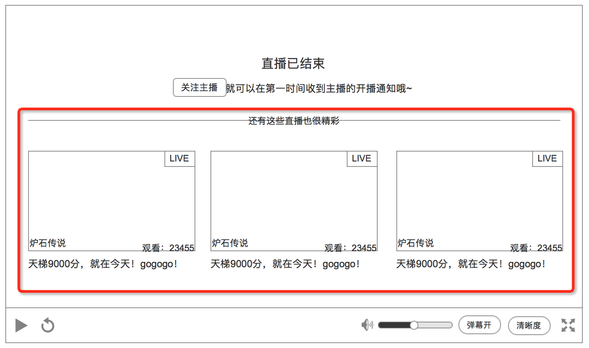
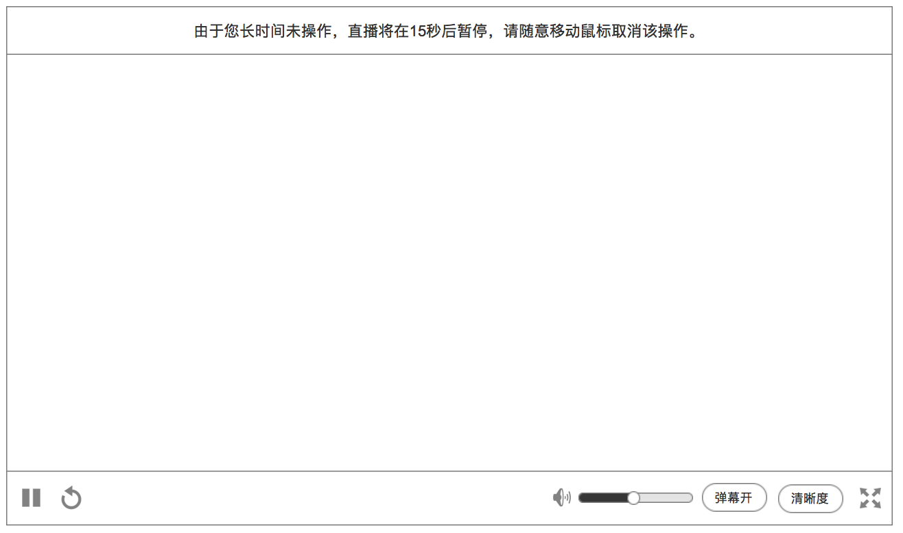

### 播放器状态

* 播放器有多种状态，每一种都有提示
* 提示的位置都是屏幕中央，无论是 **播放器默认**、还是 **播放器全屏**
* 当出现提示时，操作UI会出现

### 提示列表 {#top}
1. [片头开始](#1)
2. [无网络](#2)
3. [加载失败](#3)
4. [缓冲中](#4)
5. [暂停中](#5)
6. [主播暂停直播](#6)
7. [主播不在](#7)
8. [直播结束](#8)
9. [预告](#9)
10. [用户长期无操作](#10)

### 1. 片头开始 {#1}

爱拍字样下的线条，是动的，表示正在载入中

播放器内部有背景图，避免加载过程单调

[回到列表](#top)

### 2. 无网络 {#2}

**`重试`**，和操作UI上的 **重新载入** 一样的作用

覆盖在当前的视频上，有一层蒙版降低视频的透明度

[回到列表](#top)

### 3. 加载失败 {#3}

**`重试`**，和操作UI上的 **重新载入** 一样的作用

覆盖在当前的视频上，有一层蒙版降低视频的透明度

[回到列表](#top)

### 4. 缓冲中 {#4}

加载中字样上面的图标，是动的，表示在加载中

覆盖在当前的视频上，有一层蒙版降低视频的透明度

[回到列表](#top)

### 5. 暂停中 {#5}

覆盖在当前的视频上，有一层蒙版降低视频的透明度

[回到列表](#top)

### 6. 主播暂停直播 {#6}

提示显示在屏幕中央

覆盖在当前的视频上，有一层蒙版降低视频的透明度

[回到列表](#top)

### 7. 主播不在 {#7}

**`关注主播`**，作用和房间信息里的 **关注主播**，一样

点击后，变成 **`已关注`**

红色标记部分为 [推荐信息](recommend.md) 功能，显示逻辑在该功能内部描述

[回到列表](#top)

### 8. 直播结束 {#8}

**`关注主播`**，作用和房间信息里的 **关注主播**，一样

点击后，变成 **`已关注`**

红色标记部分为 [推荐信息](recommend.md) 功能，显示逻辑在该功能内部描述

[回到列表](#top)

### 9. 预告 {#9}

#### 预告：在 [运营后台]() 去设置的公告内容，用于预告下次直播的时间

**`关注主播`**，作用和房间信息里的 **关注主播**，一样

点击后，变成 **`已关注`**

红色标记部分为 [推荐信息](recommend.md) 功能，显示逻辑在该功能内部描述

[回到列表](#top)

### 10. 用户长期无操作 {#10}

在观看直播时，用户超过10分钟，都没有任何活动（包括：鼠标、键盘），就会自动暂停直播，出现提示

提示语出现在屏幕中央

[回到列表](#top)
