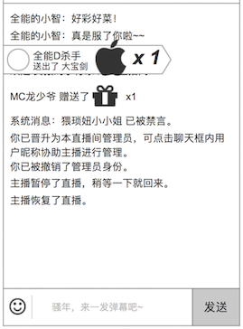
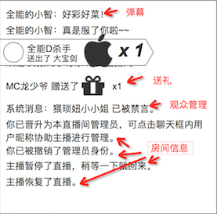

### 概述
* **用户被禁言、输入的弹幕、送礼**，这些记录信息（log）会出现在这里
* **是一个输入+输出的功能，弹幕、送礼、观众管理、房间信息、运营位，都会在这里进行部分或全部交互**

### 1. 界面

### 2. 发弹幕和表情
详细见 [弹幕](danmaku.md)的发弹幕

### 3. 聊天信息列表
* 不同类型的聊天信息，用不同颜色显示，美术把握颜色
* 最新信息，在下方显示，信息自动往上滚动

显示以下类型的信息

#### 聊天信息类型
1. 弹幕
	* 信息可见度：全体
	* 用户发的弹幕
	* **显示格式**为：`用户身份` `用户名` **冒号** `发言内容`
	* 举例：房管 水晶龙：新一轮直播即将开始啦～～～
2. 送礼
	* 信息可见度：全体
	* 送礼的记录
	* **显示格式**为：`用户身份` `用户名` 送出了 `礼物名` `x N`
	* 举例：乐树 送出了 小翅膀 x5
3. 房间状态信息
	* 信息可见度：全体
	* **显示格式**为：直播间 `行为`
	* `行为` 列表：
		* `已结束，欢迎下次收看`。房间关闭
		* `已经断开，正在重连`。失去网络连接
	* 举例：直播间 已结束，欢迎下次收看
4. 用户信息
	* 信息可见度：全体，部分只有自己
	* **显示格式**为：`用户身份` `用户名` `行为`
	* `行为` 列表：
		* `进入房间`。用户进入房间
		* `禁言已解除`。达到禁言时间，系统自动解禁，**只有自己可见**
	* 举例：小蝴蝶 禁言已解除
5. 管理信息
	* 信息可见度：全体
	* **显示格式**为：`用户身份` `用户名（主播、管理员）` 将 `用户名` `行为` `30分钟`
	* `行为` 列表：
		* `禁言`
		* `踢出`
		* `提升为管理员`。没有时效性限制
		* `的管理员资格取消了`。没有时效性限制
	* 举例子：**主播** 小羊羊 将 飞翔的牛 禁言 30分钟
	* 管理行为详细见 [观众管理](usermanage.md)
	* 示意图。内容以文档规则为准

### 4. 用户身份的标记
显示用户身份的标记

详细见 [观众管理](usermanage.md) 的 用户身份的标记

### 5. 对用户的操作
* 如果是房管，会增加 `禁言` `踢出`，详细见 [观众管理](usermanage.md)
* 如果是管理员，点击观众，还会增加 `提升为房管`，让该选中的用户获得房管的权限，详细见 [房间信息](roomadmin.md)

### 6. 运营位
在运营后台设置的推广位置，用户可以手动关闭，刷新页面前不会再出现

