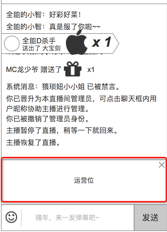

### 概述
* **用户被禁言、输入的弹幕、送礼**，这些记录信息（log）会出现在这里
* **是一个输入+输出的功能，弹幕、送礼、观众管理、房间信息、运营位，都会在这里进行部分或全部交互**

### 1. 界面

### 2. 发弹幕和表情
详细见 [弹幕](danmaku.md)的发弹幕

### 3. 聊天信息列表
* 不同类型的聊天信息，用不同颜色显示，美术把握颜色
* 最新信息，在下方显示，信息自动往上滚动

显示以下类型的信息

#### 聊天信息类型
1. 弹幕。用户发的弹幕
	* **显示格式**为：`用户身份` `用户名` `冒号` `发言内容`
2. 送礼。送礼的记录
	* **显示格式**为：`用户身份` `用户名` 送出了 `礼物名` `x N`
3. 房间状态信息。ex：直播间暂停
	* **显示格式**为：直播间 `行为`
4. 用户信息。ex：用户进、用户禁言解除
	* **显示格式**为：`用户身份` `用户名` `行为`
5. 管理信息。ex：主播将某观众提升为管理员、某用户被禁言
	* 禁言、踢出
		* **显示格式**为：`用户身份` `用户名（主播、管理员）` 将 `用户名` `行为` `10分钟`
		* 管理行为详细见 [观众管理](usermanage.md)

### 4. 用户身份的标记
显示用户身份的标记

详细见 [观众管理](usermanage.md) 的 用户身份的标记

### 5. 对用户的操作
* 如果是房管，会增加 `禁言` `踢出`，详细见 [观众管理](usermanage.md)
* 如果是管理员，点击观众，还会增加 `提升为房管`，让该选中的用户获得房管的权限，详细见 [房间信息](roomadmin.md)

### 6. 运营位
在运营后台设置的推广位置，用户可以手动关闭，刷新页面前不会再出现

