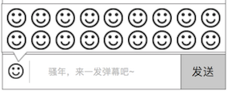

###  弹幕
功能分成2部分

1. 发弹幕
2. 弹幕显示

### 1. 发弹幕
在 [聊天列表](chatlist.md) 模块下的输入框，才能发弹幕

规则

* 在 播放器默认 下，聊天列表 里才能发弹幕
* 播放器全屏，暂时不支持发弹幕
* 最大的输入字数为20字，可以和表情一起发
* 支持发emoji，由于emoji各个系统可能有差异，不做统一，识别出来是如何，就展示什么
* 发送后，有3秒冷却，**`发送`** 按钮置灰

### 2. 弹幕显示
有2个地方显示弹幕

1. 主要在播放器里
2. 其次在聊天列表里

#### 在播放器里

会是这样的

此规则适用于播放器默认、播放器全屏

* 方向：从右到左
* 颜色：随机。主要是黄色（高几率），爱拍的主题色，混搭2个其他颜色（低几率）
* 弹幕，出现的水平位置是按照从上到下的队列排列的，满行时放到下一行显示，如此循环
* 目前弹幕不支持用户自定义字号、字体颜色、出现为止、出现方式

#### 在聊天列表里
纯粹就是聊天记录的形式，用户发了什么，就显示这条记录，详细见 [聊天列表](chatlist.md) 的聊天信息列表
