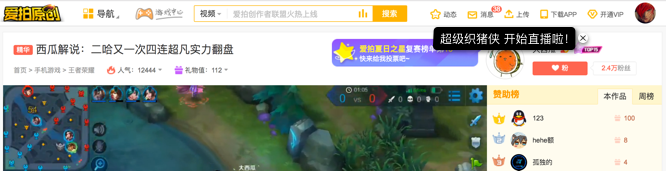
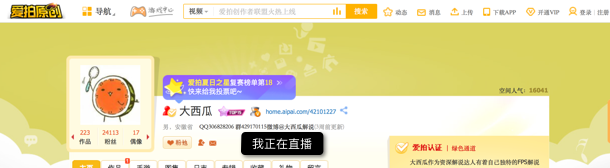
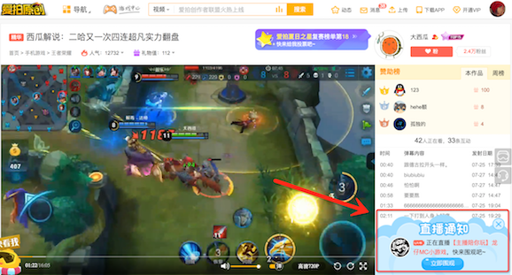

### 入口的定义
* 根据情况，出现不同入口
* 其中运营位，可以在后台控制
* 通过不同的入口，最终都是进入到直播房间

### 1. 即时消息

* 已关注的作者，进行直播
* 在首页、播放器里，会出现的浮层通知
* **该功能已经在爱拍平台里使用**

#### 触发

* 关注的主播开始直播时

### 2. 作者的个人空间

* 如果作者在直播
* 那么进入他个人空间时，会看到“我正在直播”的提示
* **该功能已经在爱拍平台里使用**

#### 触发
* 主播开始直播时，显示
* 结束直播时，隐藏

### 3. 运营位

* 爱拍运营后台配置的
* 用于运营推广制定的主播
* 无论是否已关注的作者
* 只要观众在录播视频页时，就会弹出提示
* **该功能已经在爱拍平台里使用**

#### 触发
* 在爱拍的运营后台配置时生效，直到取消

