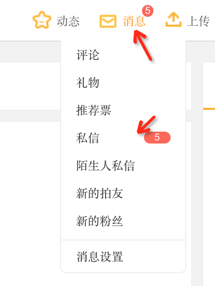
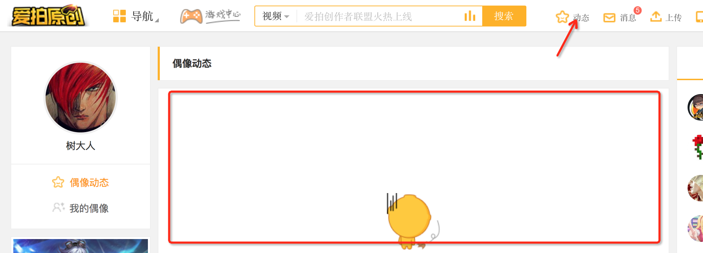
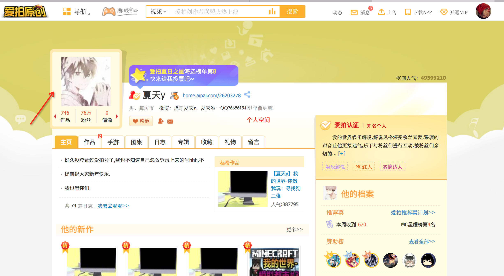

### 入口的定义
* 根据情况，出现不同入口
* 后台可以控制入口的出现
* 通过不同的入口，最终都是进入到直播房间

### 1. 方式1-全站浮层
通过后台，设置某些重要的直播推送到全站，只要用户在aipai.com，就会收到该推送，不可以关闭，但是可以缩小

### 2. 方式2-消息中心
关注了主播后，当主播开播时，会收到推送消息，点击后直接进入直播间

### 3. 方式3-动态
用户的个人空间，关注了的主播开播时，会收到一条动态，点击后进入房间

### 4. 方式4-个人空间
主播的个人空间，可以看到正在直播的提示
