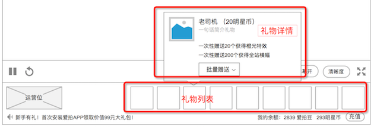

### 送礼
* 送礼主要由3个功能组成：赠送礼物、送礼效果、礼物设定
* 送礼，这个行为，是 播放器默认状态下，在 播放器 下方进行的，罗列礼物列表。目前pc只有这个赠送入口
* [礼物效果](gifteffect.md)，送礼后，会在聊天列表显示浮层的动画效果，大额的送礼，会在播放器里作为特殊的弹幕滚动

### 1. 界面

### 2. 赠送礼物

在 播放器 下方，列出了所有礼物

* 在礼物上，鼠标悬停时，出现 [礼物详情](#giftview)
* 在礼物上，单击时，赠送 1个 礼物，初次点击时，会触发 [连送效果](#giftrenzoku)
* 点击后，出现赠送 赠送详情

### 3. 礼物详情 {#giftview}

在礼物上，鼠标悬停时，触发，点击“批量赠送”，会展开菜单

* 选择赠送的数量，确认赠送
* 批量赠送的数量是固定的
* 批量赠送礼物，会触发额外的礼物效果，详细见 [礼物效果](gifteffect.md)
* 如果余额不足，会提示是否进行充值

### 4. 连送效果 {#giftrenzoku}

通过连续赠送同一个礼物，会触发连送效果，表现为：

* 播放聊天列表里的动画
* 计数动画叠加
* 每次点击，都会触发
* 当上一次触发仍在进行时发生新的触发，打断它，进行最新的那次触发行为

#### a. 开启连送
鼠标单击礼物，可以立即送出礼物

但是，在通过询问前时，会弹窗询问

通过询问后，指定时间内，可以猛的点击鼠标去赠送

询问项

* 确认赠送，之后都不再提醒
* 确认赠送，今天内都不再提醒
* 取消赠送

#### b. 连送规则
* 在赠送单个礼物后的3秒内，继续点击，就会触发连送
* 余额预扣除，为了应对**高速送礼**的响应速度，送礼前，在客户端判断用户的余额是否足够支付礼物价格，够的话送出礼物，播放动画等，之后再在聊天列表里出现送礼的记录，直到用户余额不足提示需要充值
* 性能要求，连送效果的出现速度和点击速度一直，点得越快，弹出越快

