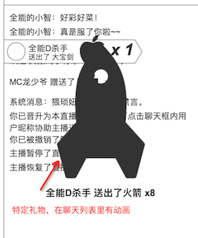

### 礼物设定
* 礼物目前有8种
* 每种的价格都不一，目前价格仅供参考高低
* 指定的礼物才有动画效果
* app、pc，使用同一套美术资源
* 每一个礼物，都有图标、动画
* 部分礼物，才有大动画

### 美术需求
整体美术风格明亮

1个礼物，最多有3个美术资源

1. 图标。icon，png，静态
	* 
	* 1. 在 **礼物列表** 显示
	* 2. 在 **聊天信息** 显示，作为聊天log的静态图片
2. 动画。gif，动画
	* 会在3个地方被使用
	* 1. 鼠标放在礼物上，**礼物详情** 里显示的礼物
	* 
	* 2. 聊天列表里的 **礼物动画**，和动图不一样，应该是另外的gif，覆盖在聊天信息上，和倒计时动画一起出现	
	* 
	* 3. **礼物弹幕**。滚动的带动图的巨大弹幕
	* 
3. 大动画。gif，动画
	* 
	* 部分价格高的礼物才会出现的

### 礼物列表

1. 稳
	* 价格：**0.1 明星币**
	* 描述语：没毛病，老铁，这波稳！
	* 美术描述：暴漫风格
2. 浪
	* 价格：**0.1 明星币**
	* 描述语：我可以划船不桨，全靠浪！
	* 美术描述：暴漫风格
3. 怼
	* 价格：**0.5 明星币**
	* 描述：闭嘴，让帅的先说话！
	* 美术描述：暴漫风格
4. 老司机
	* 价格：**1 明星币**
	* 描述语：没时间解释了，快上车！
	* 美术描述：暴漫风格
5. 制杖
	* 价格：**5 明星币**
	* 描述语：玛德制杖，主治一切不服！
	* 美术描述：暴漫风格
	* **`有大动画`**
6. 拍仔
	* 价格：**10 明星币**
	* 描述语：让我们一起来啪啪啪！
	* 美术描述：调皮可爱的拍仔，和爱拍主站设定一致
	* **`有大动画`**
7. 翅膀
	* 价格：**100 明星币**
	* 描述语：装上天使之翼，让我带你飞！
	* 美术描述：高贵的天使翅膀
	* **`有大动画`**
8. 火箭
	* 价格：**500 明星币**
	* 描述语：给我一飞冲天吧！
	* 美术描述：随时准备发射的火箭
	* **`有大动画`**