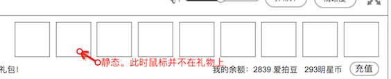

### 礼物设定
* 礼物目前有8种
* 每种的价格都不一，目前价格仅供参考高低
* 所有礼物都有动画效果（默认）
* 指定的礼物才有弹幕、大动画效果
* app、pc，使用同一套美术资源

### 美术需求
整体美术风格明亮

1个礼物，最多有3个美术资源

1. 图标。icon，png，静态
	* 
	* 1. 在 **礼物列表** 显示
	* 2. 在 **聊天信息** 显示，作为聊天log的静态图片
2. 动画。gif，动画
	* 会在3个地方被使用
	* 1. 鼠标放在礼物上，**礼物详情** 里显示的礼物
	* 
	* 2. 聊天列表里的 **礼物动画**，和动图不一样，应该是另外的gif，覆盖在聊天信息上，和倒计时动画一起出现	
	* 
	* 3. **礼物弹幕**。滚动的带动图的巨大弹幕
	* 
3. 大动画。gif，动画
	* 
	* 部分价格高的礼物才会出现的

### 礼物列表
见 [礼物配置的参考](console/giftsetting.md)