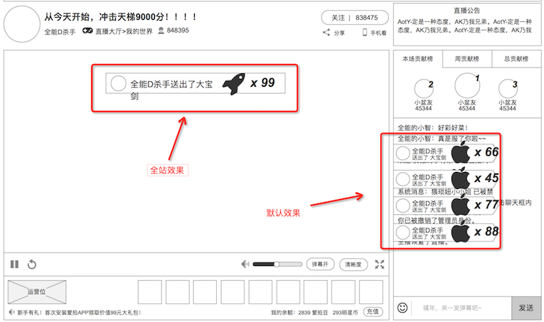

### 送礼效果
根据赠送礼物的总价格判断，会出现在不同地方

### 1. 效果分类

1. **动画效果**。聊天列表里显示，所有赠送的礼物，无论价格高低，都会在聊天列表里显示的
2. **大动画效果**。**总价高的礼物** ，会在 聊天列表+榜单 的区域内播放1次
3. **弹幕效果**。**总价高的礼物** 才会触发，在播放器里滚动，和弹幕的滚动规则一样，但是覆盖在播放器、弹幕上层

### 2. 礼物价格的衡量
有多条规则同时判断

* 单次价格达到指定数量
* 指定的礼物
* 连击次数达到指定数量

### 3. 动画效果的展示逻辑
在聊天列表里出现

规则

* 分为2部分：礼物动画、计数动画
* **礼物动画**，礼物本身循环播放的gif
* **计数动画**，赠送一个时，没有计数动画；单个礼物批量赠送时，才会出现 **从1到N** 的 **快速递增** 动画数字，N越大，递增显示的字号越大
* 最多显示3条动画效果
* 最新的出现在最下面
* 自动将旧的顶上去，达到第三条的渐出

### 4. 大动画的展示逻辑
规则

* 在 聊天列表+榜单 的区域内显示
* 送1次播放1次
* 全部观众都可以看到
* 如果有多个被同时赠送，则按时间差串联播放

### 5. 弹幕效果的展示逻辑
在播放器上出现

**只有 单个礼物批量赠送时，才会出现**

规则

* 显示格式为：`观众头像` `观众` 送出了 `礼物数量` 个 `礼物名`
* 遵从弹幕的滚动规则，详细见 [弹幕](danmaku.md)的弹幕显示
* 如果有多个被同时赠送，则按时间差触发