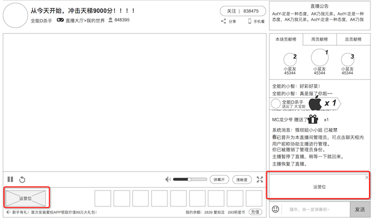

### 运营位

如图所示，有 2处 的运营位

* 左侧：礼物旁边的运营位。**该版本不实现**
* 右侧：聊天信息底部的运营位。用于推送特定房间的推广信息，在 **已有的爱拍运营后台** 设置

### 聊天信息底部的运营位
显示规则

* 不会被礼物的动画（横幅）遮盖，可能会造成无法点击关闭
* 会被礼物的大动画遮盖，如果此时有大动画出现，可能要等待动画结束后才能点击关闭，视乎动画占据的面积