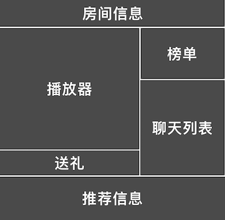

### 功能概述
由3部分组成

1. 直播房间
2. 入口
3. 直播收益

### 1. 直播房间
界面概览

头部的美术需求：使用爱拍最新的头部内容，样式使用直播平台，两者结合

---

模块构成

##### 观众，在房间里，进行绝大部份的交互，如

* 观看
* 发弹幕
* 送礼
* 充值

##### 登录状态对信息的影响
用户登录前后，看到的信息都是一样的，但是以下功能会触发验证登录状态

* 发弹幕
* 送礼
* 充值
* 关注

##### 主播，可以进行

* 观众管理
* 房间管理

### 2. 入口
均为按需出现的入口，现阶段，没有固定占据位置的，分别位于pc网页、爱拍app

### 3. 直播收益
主播可以看到自己在直播时收到的礼物、观众的增长等轻量统计，位于pc网页的个人中心