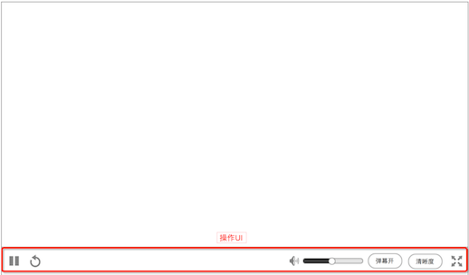

### 播放器默认

* 默认状态下看到的视频播放器
* **刚进入时，视频会自动载入，进入播放状态
**
* 可通过 **`全屏`** 按钮进入 [播放器全屏](playerfs.md)

### 触发/隐藏 控制UI
隐藏鼠标后，移动鼠标就会再次显示

触发

* **视频正在载入、异常状态时，持续显示**
* 鼠标在播放器上，从下移入，显示操作UI
* 鼠标停留播放器的操作UI上，持续显示

隐藏

* 鼠标离开播放器后，1秒，往下移出
* 鼠标在视频区域内，但不在操作UI上，无操作5秒后，往下移出，隐藏鼠标

### 控制UI
1. 暂停 / 播放
	* 控制视频播放 或 暂停
	* 支持 键盘 **`空格`** 控制，即 “按空格后暂停，按空格后播放”
2. 重新载入
	* 重新载入视频，但不刷新页面
3. 音量调节
	* 控制音量大小
	* 支持键盘 **`上下箭头`** 去控制
4. 关闭 / 开启 弹幕
	* 显示 或 隐藏弹幕
5. 清晰度
	* 切换清晰度
	* 如果视频不支持某清晰度，则置灰 
	* 标清。380p
	* 高清。720p
	* 超清。1080p
6. 全屏
	* 将视频全屏显示
	* **进入新的播放器界面，详情见 [播放器全屏](playerfs.md)**
