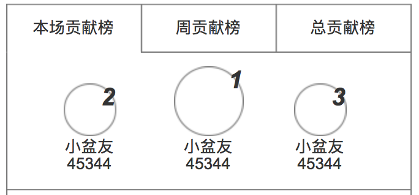
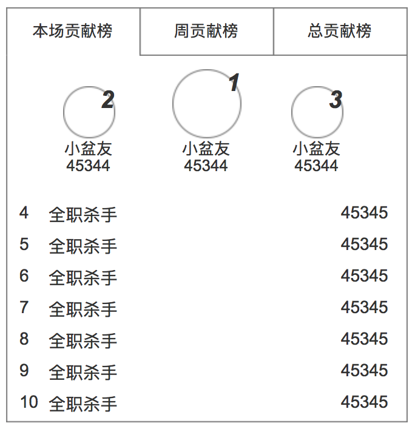

### 榜单
目前，主要针对用户的送礼统计，分为3类

### 界面
榜单的默认状态

榜单展开时

### 设定

* 鼠标在榜单上时，自动展开详细榜单，显示 4-20 名
* 展开的详细榜单，支持滚动，最多载入 20名
* 鼠标移开时，收起
* 榜单有以下状态
	* 加载中
	* 加载失败
	* 空榜单：提示文案“快点来投喂，成为第一名”

###  榜单的种类
1. 本场贡献榜
	* 在该次直播下，按送礼价格的降序排列用户，每次直播后清零
2. 本周贡献榜
	* 在本个自然周，累计至当天，按送礼价格的降序排列用户
3. 本月贡献榜
	* 在本个自然月，累计至当天，按送礼价格的降序排列用户
