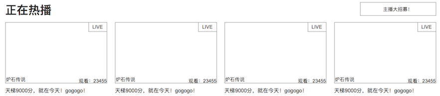
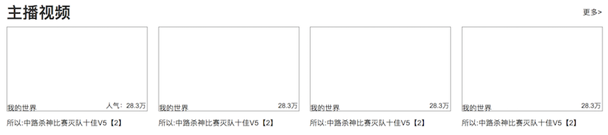
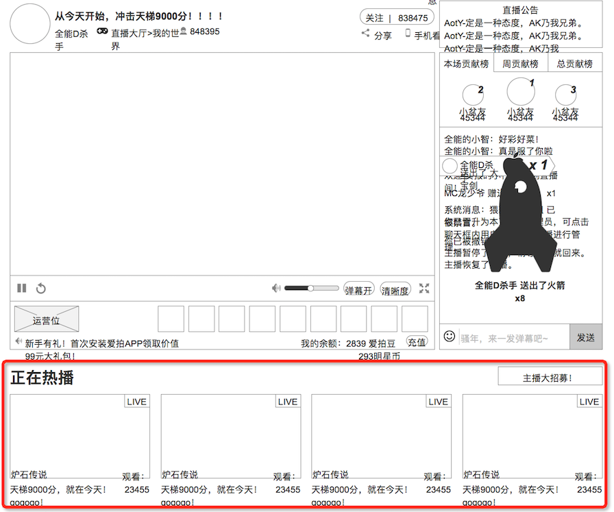
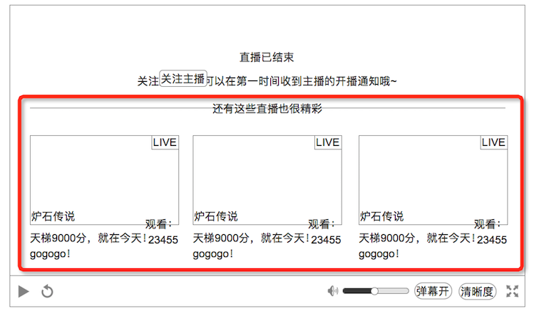
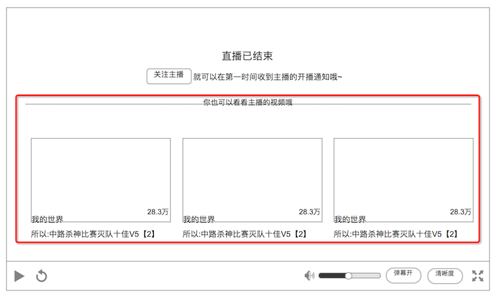
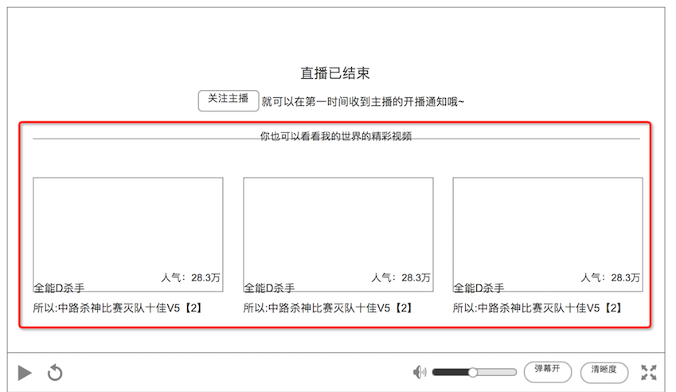

# 推荐信息
* 有3类推荐信息
* 按照优先级依次显示，如果没有则不显示
* 被不同功能调用，显示的形式会不同

### 1. 类型1-其他正在直播的房间

其他正在直播的房间

按照观看人数降序排列

**`主播大招募`** ：点击后，进入主播的招募页面，目前还没有规划页面，可以先屏蔽

### 2. 类型2-录播视频

主播录播、制作的视频列表

按照视频发布时间降序排列，不区分游戏

**`更多`** ：进入主播的视频列表页

### 3. 类型3 同游戏视频

同类游戏的视频

按照爱拍的精华规则排列

意味着，房间属性里，要有游戏标签，通过该标签去筛选出对应游戏视频列表

### 4. 显示优先级
#### a. 直播房间 页面，在 播放器下方 被调用时
1. 其他正在直播的房间
2. 主播视频
3. 同游戏视频

3类都有的话，**3类都依次显示**

就是这里

#### b. 播放器 内，被 状态和提示 调用时
1. 其他正在直播的房间
2. 主播视频
3. 同游戏视频

优先级依次递减，**每次只显示1个**

就是这里

