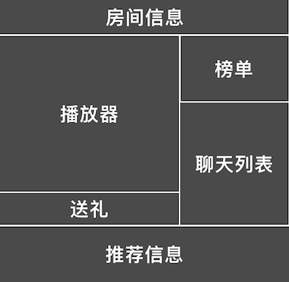

### 功能概述

由3部分组成

1. 直播房间
2. 入口
3. 直播收益

### 直播房间
模块构成

##### 用户，在房间里，进行绝大部份的交互，如

* 观看
* 发弹幕
* 送礼
* 充值

##### 主播，可以进行

* 观众管理
* 房间管理

### 入口
均为按需出现的入口，现阶段，没有固定占据位置的

### 直播收益
主播可以看到自己在直播时收到的礼物、观众的增长等轻量统计